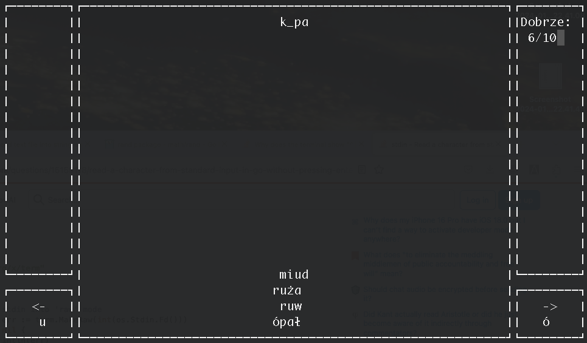

# ortotris

This project is a small, terminal-based orthography game designed for my kids. It is inspired by the classic DOS game Ortotris, released in 1992, which was similar to Tetris but focused on improving spelling skills. The game runs in the terminal and follows a similar concept to help players with orthography.

See screenshot below:

### Running

To play the game just run:

    go run *.go zagraj -f words-u-o.txt

### Instructions
Words descend from the top of the screen, similar to Tetris, but with one or two missing letters, indicated by an underscore (_). Use the left and right arrow keys to select one of the available letters before the word reaches the bottom. If an incorrect letter is chosen, the word will remain at the bottom. You can also press the down arrow to drop the word immediately.

### Words file
The words for the game are provided via the `-f` argument, and the file's format is straightforward.

The first line specifies two or more letters that the player will choose between, separated by a colon (`:`). The following lines contain the words, which will be shuffled during the game. Each line includes two values, also separated by a colon. The first value is the word, with the missing letter(s) represented by an underscore (`_`), and the second value is the correct answer.

For example, a sample file might look like this:

    u:ó
    r_ża:ó
    mal_je:u
